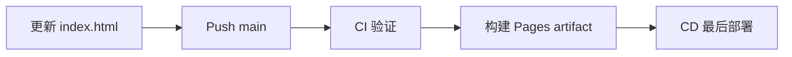

# AI Daily Brief

一份面向 AI builders 的中文每日技术简报，关注真正影响开发实践的新模型、Agent/Coding Agent、AI engineering、开源项目、评测与安全动态。

[](https://github.com/Mira190/ai-daily-brief/actions/workflows/pages.yml)
[](https://mira190.github.io/ai-daily-brief/)

## 在线阅读

最新版本：

<https://mira190.github.io/ai-daily-brief/>

## 内容方法

简报采用以下流程：

1. 以 `Australia/Sydney` 时区的过去 24 小时为主窗口，并保留滚动 7 天热点追踪。
2. 宽扫实验室与作者博客、Hacker News、GitHub、Hugging Face、arXiv、Product Hunt、公开社交讨论和高质量技术博客。
3. 对陌生且快速升温的名词、论文、架构和项目进行二次检索。
4. 回到原始公告、论文、仓库或作者原文反向核查。
5. 按“事件增量”与最近 7 天归档去重，不用没有新进展的旧闻补数。
6. 对技术实质、传播速度、开发者影响和证据成熟度分别判断。

## 站点功能

- 按年份和月份折叠浏览历史简报
- 日期切换与当前简报搜索
- 暗色模式
- 移动端布局
- 打印友好样式
- 单文件静态站点，无后端、无追踪脚本

## 自动发布

每日简报生成并通过结构、来源与隐私检查后，更新根目录的 `index.html`。任何包含 `index.html` 更新并进入 `main` 的提交，都会自动触发 GitHub Actions：

1. Checkout 当前 `main` snapshot。
2. 验证 HTML 完整性、日期/article 映射、内嵌 JavaScript 语法与公开内容隐私规则。
3. 配置并启用 GitHub Pages。
4. 将通过验证的静态文件打包为 Pages artifact。
5. 最后才部署到固定站点地址；任何前置步骤失败都会阻止发布。

不需要服务器、数据库、部署密钥或人工上传。也可以在仓库的 **Actions → Deploy AI Daily Brief → Run workflow** 手动重跑部署。



发布遵循 fail-safe 原则：生成、归档或检查失败时不推送；部署失败时保留上一版可用站点。

### 部署入口

- 线上站点：<https://mira190.github.io/ai-daily-brief/>
- Workflow：<https://github.com/Mira190/ai-daily-brief/actions/workflows/pages.yml>
- 部署配置：[`.github/workflows/pages.yml`](.github/workflows/pages.yml)

## 仓库结构

```text
.
├── index.html                  # 完整简报归档与交互界面
├── README.md                   # 项目说明
├── SECURITY.md                 # 安全与隐私政策
├── .nojekyll                   # 禁用 Jekyll 转换
└── .github/workflows/pages.yml # GitHub Pages 部署
```

## 安全与隐私

本仓库只包含公开来源的简报正文和静态界面。“相关性”分析面向通用 AI Engineer，不使用具体读者的雇主、项目、教育经历或个人工作流。本仓库不应提交 API key、访问令牌、内部文件标识、用户账号信息、本地绝对路径、研究缓存或其他 PII。详情见 [SECURITY.md](SECURITY.md)。

## 信息边界

简报是技术信息筛选与分析，不构成投资、法律、医疗或安全授权建议。厂商 benchmark、作者声明、早期论文与独立复现会尽量明确区分。
